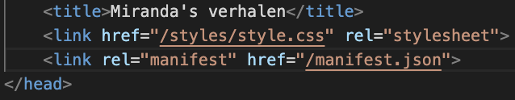
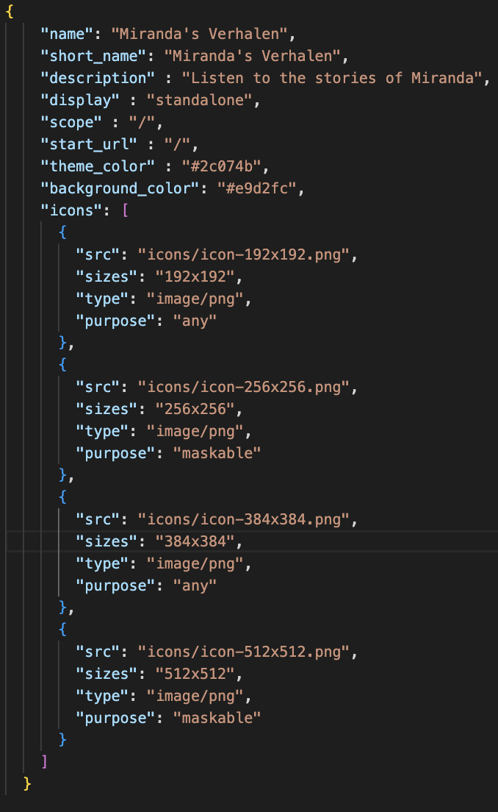
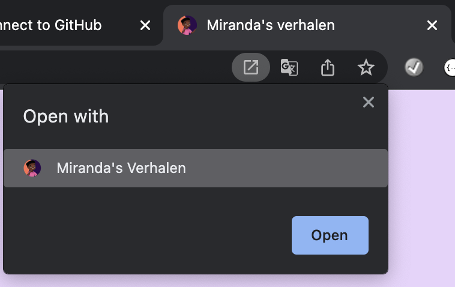
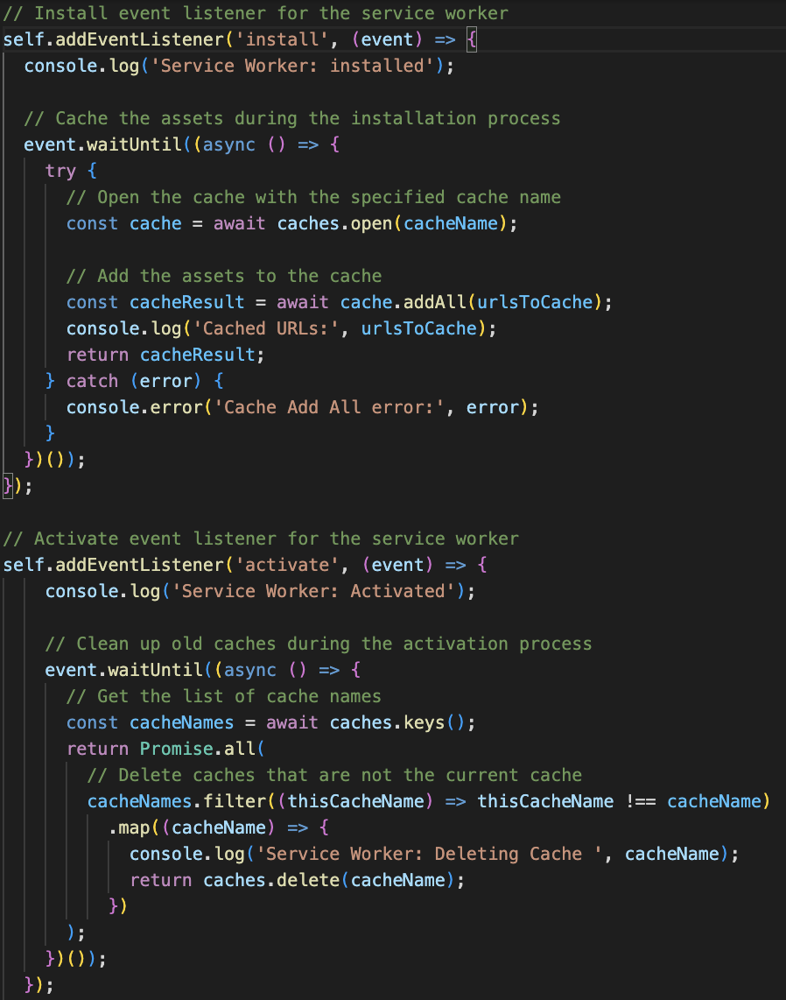
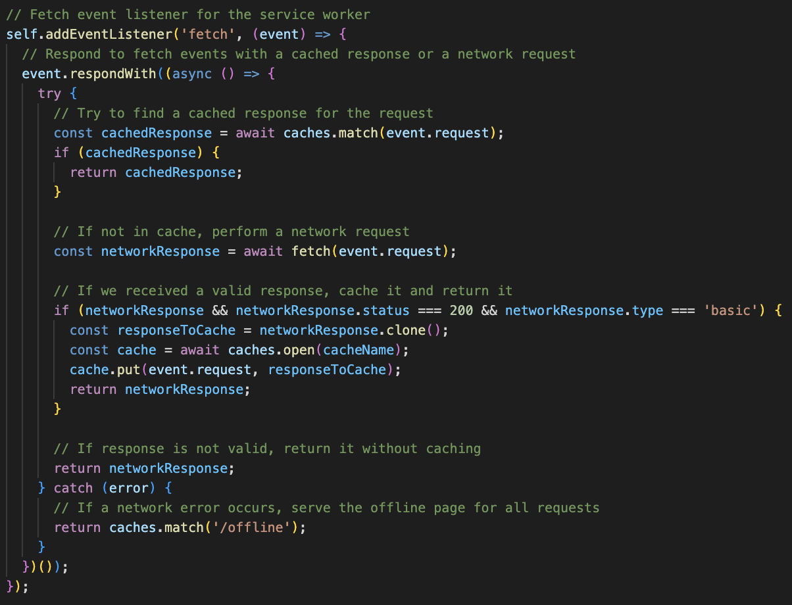
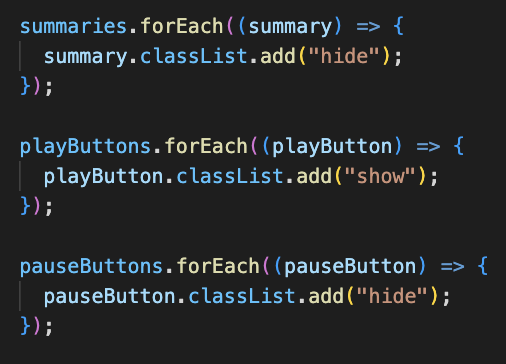
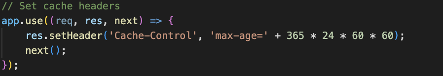
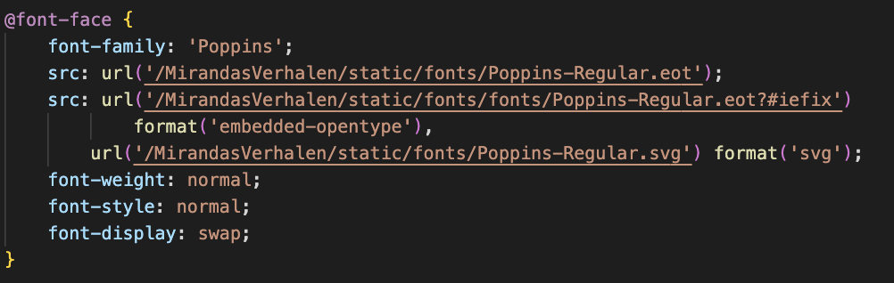

# Miranda's Verhalen

translate to english

Op de single webpage "Miranda's Verhalen" maak ik een concept web app die de verhalen van schrijfster Laila de Miranda door middel van de [Web speech API](https://developer.mozilla.org/en-US/docs/Web/API/Web_Speech_API) uitspreekt zodat kinderen makkelijker en beter in contact kunnen komen met literatuur in een digitale wereld waarbij dat bijna niet meer het geval is.

## Assignment

1. Refactor client side javascript with api into serverside javascript using express and node.js
2. convert website into a progressive web app using a manifest to make it downloadable.
3. Add a service worker to make the PWA accessible when there is no internet connection.
4. Add critical rendering paths to optimize performance

---

## Project Process
### Week 1

For the first week I first initiated npm inside my project to create a package.json, then I continued to install node.js, express, ejs and a developer tool called Nodemon. This tool makes sure I don't have to refresh the server each time I make a change inside the project.

Quickly I found out that the speech API that I chose is clientside only, therefore I had to add a different API to still be able to meet the assignment requirements. The API that I used for the serverside javascript is called Opensheet. With the opensheet API I am able to get the data from google spreadsheets on serverside and then manipulate that data to my usecase, which is using the speech api to actually vocalize the story summary.

``` synthesizer.js
if (listItem) {
          const listItems = Array.from(storyList.children);
          let index = listItems.indexOf(listItem) + 1;
          index = index.toString();
        
          const story = apiStoryListJson.find((story) => {
            return story.id === index;
          });

          const summaryUtterance = new SpeechSynthesisUtterance(story.summary);
  
          summaryUtterance.onend = (event) => {
            console.log("SpeechSynthesisUtterance.onend");
          };
  
          summaryUtterance.onerror = (event) => {
            console.error("SpeechSynthesisUtterance.onerror" + " " + event.error);
          };
  
          synth.speak(summaryUtterance);
          playButton.classList.remove("show");
          playButton.classList.add("hide");
          pauseButton.classList.remove("hide");
          pauseButton.classList.add("show");
        } else {
          console.log("Not a story summary");
        }
```

After implementing the opensheet api logic with a fetch I started on refactoring the code into express node.js and ejs. By breaking up the front-end and back-end code into seperate components I make each side of the application better to manage and read (MVC code pattern). With the finished API logic I setup a route for the home page (as this is the only page that has information for the api) and also immediately set up a controller which gets the information from the API model. In the home controller I get the data from the API and return that data inside the res.render. By doing this I make the fetched data accessible on the home page.

After doing this I created a ejs loop which creates story list items for each item in the array storyData. Then I need to verify if clicked list item is matched with the right ID. By using the event.target.closest() I can solve the problem of matching the list item index with the story.id. During this process I ran into the problem of matching strings with numbers, it took me quite a while to actually figure this out but by consulting a classmate we figured it out, we fixed it using index.toString(). After after we fixed this issue the synthesizer functionality finally worked. 

The next challenge at hand was making the web app actually downloadable. For this we need a manifest.json file which needs to be in the public folder which is used in express. After adding the manifest.json file the last thing to do is to add it in de head like this.





If the manifest is linked correctly and all the information neccesary for download is filled in then your application becomes downloadable and runnable as a actual Progressive Web App.



### Week 2

During week 2 we had to implement a service-worker which would handle the offline experience of a user so that even if there is no internet some experience can be happening. This part of the project was quite hard, Actually connecting to the service-worker was quite a hasle. I found out that my app.use public wasn't coded correctly and wasted a lot of time on that. After that I asked some help from a classmate setting it up, she told me that I needed 4 functions for it to work properly, a register, a install, an activate and last but not least a fetch function. 

With this information I started doing research on how I would make these functions in order to make my service worker actually work.

For the install function I created a event, which is triggered when the service worker is installed. The code inside the event listener caches the URLs specified in urlsToCache. First, the cache is opened using caches.open(), and then the assets are added to the cache using cache.addAll(). The event.waitUntil() method makes sure that the service worker will only be installed after the caching is completed.

For the activate I created a event, which is triggered when the service worker becomes active. The code inside the event listener deletes old caches that are no longer needed. It uses caches.keys() to get a list of cache names, and then it filters out the caches that have a name different from cacheName. Finally, it deletes the filtered caches using caches.delete().



For the fetch I created a event, when the event is triggered, the service worker checks if there is a cache for the request using caches.match(event.request). If there is a cache, it is returned immediately using return cachedResponse. If there is no cache available for the request, the service worker performs a network request using fetch(event.request). If a valid response is received from the network, with a status of 200 and a response type of basic, it is cached using cache.put(event.request, responseToCache) and returned using return networkResponse. If there is no valid response from the network or if a network error happens, the service worker returns the offline page using return caches.match('/offline').



These functions will make sure that the service-wroker allows the webapplication to be used offline by returning carched resources even without internect connection. This greatly improves the user experience by providing faster page load and reducing the number of network requests made.

### Week 3

After finishing the service-worker.js I still had some refactoring to do because in the assignment I had to make sure that the javascript was converted to the service side but as my API is only usable on clientside I had to refactor some css class manipulation in a different way. I used to have a hide class on stories which would be toggled in the clientside javascript. After refactoring I swapped the logic from the stories always being hidden to always available and then only manipulate in javascript to hide them. This way when there is no javascript active the user is still able to read the stories.



Last but not least I arrived at the critcical rendering criteria, I researched about minify using Gulp. It is a nice way of optimalizing the performance of the application. As my web app is quite small it wasn't necessary to use this though. Instead I used cache control on my header and used the font-face display swap to optimalize.




### Activity diagram


[Live demo](bandicoot-underclothes.cyclic.app/)

<!-- replace the code in the /docs folder with your own, so you can showcase your work with GitHub Pages 🌍 -->

<!-- Add a nice poster image here at the end of the week, showing off your shiny frontend 📸 -->

<!-- Maybe a table of contents here? 📚 -->

<!-- How about a section that describes how to install this project? 🤓 -->

<!-- ...but how does one use this project? What are its features 🤔 -->

<!-- What external data source is featured in your project and what are its properties 🌠 -->

<!-- Maybe a checklist of done stuff and stuff still on your wishlist? ✅ -->

<!-- How about a license here? 📜 (or is it a licence?) 🤷 -->
